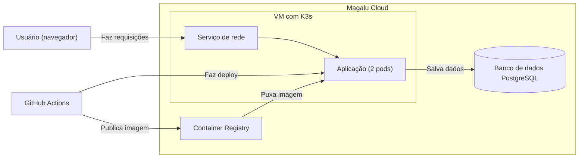

# move-tech-cloud-application-comp-3

[](https://github.com/Eli-diane/projeto-cloud/actions/workflows/deploy.yml)
[](https://www.python.org/)
[](https://fastapi.tiangolo.com/)
[](https://k3s.io/)

Ponto de partida da **Competência 3 — Desenvolvimento e Operação de Aplicações (DevOps)**.

Este repositório é um template. Use-o como base para criar o seu próprio repositório e trabalhar na competência.

> Parte do curso **Move Tech** — Magalu × Prósper Digital Skills  
> Formação em Cloud Computing para iniciantes

---

## O que tem aqui

Uma API simples de micro e-commerce com pedidos e itens, construída em Python com FastAPI.

A aplicação armazena os dados em memória. Ainda não tem deploy na nuvem — isso é exatamente o que você vai fazer nesta competência.

### Endpoints disponíveis

| Método | Rota | Descrição |
|--------|------|-----------|
| `GET` | `/health` | Verifica se a API está no ar |
| `POST` | `/orders` | Cria um novo pedido |
| `GET` | `/orders` | Lista todos os pedidos |
| `GET` | `/orders/{id}` | Retorna um pedido com seus itens |
| `DELETE` | `/orders/{id}` | Cancela um pedido |
| `POST` | `/orders/{id}/items` | Adiciona um item ao pedido |
| `GET` | `/orders/{id}/items` | Lista os itens de um pedido |

---

## O que você vai fazer nesta competência

Ao final da Competência 3, a aplicação deve estar **versionada, conteinerizada e publicada na Magalu Cloud**.

- [x] Publicar a imagem no Container Registry da Magalu Cloud
- [x] Criar o manifest Kubernetes (`k8s/app.yaml`)
- [x] Fazer o deploy no cluster Kubernetes da Magalu Cloud
- [x] Configurar o pipeline de CI/CD no GitHub Actions

---

## O Dockerfile

O repositório já inclui um `Dockerfile` pronto. Ele define como a aplicação é empacotada em uma imagem Docker:

```dockerfile
FROM python:3.11-slim          # Imagem base com Python 3.11

WORKDIR /app                   # Diretório de trabalho dentro do container

RUN pip install poetry==1.8.3  # Instala o gerenciador de dependências

COPY pyproject.toml poetry.lock* ./
RUN poetry config virtualenvs.create false && \
    poetry install --without dev --no-root  # Instala apenas as dependências de produção

COPY app/ ./app/               # Copia o código da aplicação

EXPOSE 8000                    # Porta que a aplicação vai escutar

CMD ["uvicorn", "app.main:app", "--host", "0.0.0.0", "--port", "8000"]
```

O `docker-compose.yml` usa esse Dockerfile para construir e rodar a aplicação localmente. Na nuvem, o pipeline faz o mesmo — constrói a imagem e publica no registry.

> **Referência:** [Dockerfile — Documentação oficial Docker](https://docs.docker.com/reference/dockerfile/)

---

## Como rodar localmente

**Pré-requisito:** [Docker Desktop](https://www.docker.com/products/docker-desktop/) instalado (Mac e Windows) ou [Docker Engine](https://docs.docker.com/engine/install/) (Linux).

```bash
docker compose up --build
```

Acesse a documentação interativa em: http://localhost:8000/docs

---

## Próxima etapa

Ao concluir esta competência, a solução de referência será publicada em:  
[move-tech-cloud-application-comp-4](https://github.com/move-tech-cloud-computing/move-tech-cloud-application-comp-4)

---

> Inspirado no tutorial [Construindo APIs robustas utilizando Python](https://github.com/luizalabs/tutorial-python-brasil) do LuizaLabs.

---

## O que foi adicionado neste projeto

### Arquitetura da solução



[Documentação completa da arquitetura](docs/architecture.md)

### Estrutura do projeto

```
projeto-cloud/
├── .github/workflows/    # Pipeline CI/CD
├── app/                  # Código da API
│   ├── main.py           # Endpoints FastAPI
│   ├── models.py         # Modelos de dados
│   └── database.py       # Conexão com banco
├── docs/                 # Documentação
│   ├── architecture.md   # Arquitetura da solução
│   ├── data-model.md     # Modelagem de dados
│   └── adr/              # Decisões técnicas (ADRs)
├── k8s/                  # Manifests Kubernetes
│   └── app.yaml
├── tests/                # Testes automatizados
├── Dockerfile
├── docker-compose.yml
├── pyproject.toml
└── README.md
```

### Tecnologias utilizadas

| Camada | Tecnologia |
|--------|------------|
| **Linguagem** | Python 3.11 |
| **Framework** | FastAPI |
| **Banco de dados** | PostgreSQL (DBaaS Magalu) |
| **Orquestração** | Kubernetes K3s |
| **CI/CD** | GitHub Actions |
| **Monitoramento** | Prometheus + Grafana |
| **Container Registry** | Magalu Cloud Registry |
| **Infraestrutura** | Magalu Cloud (VPC, VM, Security Groups) |

### Documentação adicional

- [Arquitetura da solução](docs/architecture.md)
- [Decisões técnicas (ADRs)](docs/adr/)
- [Modelo de dados](docs/data-model.md)

---

## Sobre o projeto

Este projeto foi desenvolvido como parte da formação **Move Tech** — uma parceria entre **Magalu** e **Prósper Digital Skills** para capacitação em Cloud Computing.

O repositório evoluiu ao longo de 6 competências, abordando desde versionamento de código até observabilidade e arquitetura de soluções em nuvem.
