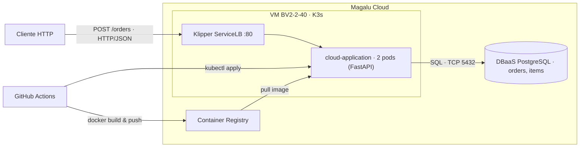

# Arquitetura da Solução — API de Pedidos

## Visão geral - O que é o sistema?

Sistema de pedidos (como um mini e-commerce) que roda na nuvem da Magalu Cloud. Ele foi construído para ser simples, rápido e fácil de manter.

Do ponto de vista técnico, é uma API containerizada, rodando em um cluster Kubernetes leve (K3s), com banco de dados gerenciado, imagens versionadas em um Container Registry e deploy automatizado via GitHub Actions.

---

## Diagrama C2 · Container

---

## Componentes da arquitetura

| Componente | Serviço MGC | Função (em poucas palavras) |
|------------|-------------|-----------------------------|
| **API** | K3s (VM single node) — 2 réplicas | Processa as requisições HTTP (recebe e gerencia pedidos). |
| **Banco de dados** | DBaaS PostgreSQL | Onde os pedidos e itens são salvos de forma segura. |
| **Imagens** | Container Registry | Armazena as diferentes versões da aplicação. |
| **Tráfego externo** | Klipper ServiceLB (IP da VM, porta 80) | Distribui as requisições entre as réplicas e expõe a API para a internet. |
| **CI/CD** | GitHub Actions | Automatiza os testes, a construção da imagem e o deploy. |

---

## Como tudo se conecta - Fluxo:

1. Um usuário acessa a API pelo IP público da VM.
2. O ServiceLB direciona a requisição para um dos pods da aplicação.
3. A API processa o pedido e interage com o banco de dados PostgreSQL.
4. Quando o código muda no GitHub, o pipeline de CI/CD é acionado automaticamente.
5. O pipeline testa, constrói a imagem, publica no registry e faz o deploy no cluster.

---

## Requisitos não-funcionais  - O que se espera do sistema:

| Requisito | Como medimos | Alvo | Tradução |
|-----------|--------------|------|----------|
| **Disponibilidade** | Erros 5xx e tempo de atividade das probes no Grafana | 99,5% mensal | Quase nunca fora do ar. |
| **Latência** | `histogram_quantile(0.95, ...)` do `/metrics` | P95 < 500 ms | Responde rápido em 95% das vezes. |
| **Escalabilidade** | Teste de carga (k6) + `rate(http_requests_total)` | 300 req/s sem degradar | Aguenta até 300 pedidos por segundo. |
| **Custo** | VM + DBaaS + IP na calculadora da Magalu | Teto definido em ADR | Gasto controlado e previsível. |

---

## Estilo arquitetural

A solução é um **monolito em camadas**:
- **Apresentação**: o que o usuário vê (API)
- **Serviço**: a lógica de negócio (processamento de pedidos)
- **Dados**: persistência no banco

Ele está implantado como um único container com duas réplicas.  
Se um dia precisar separar funcionalidades (ex: notificações), pode-se extrair um segundo serviço — isso já está planejado como evolução.

---

## Trade-offs das decisões - Pró e Contras:

| Aspecto | Decisão tomada | Alternativa não escolhida | Motivo da escolha |
|---------|---------------|--------------------------|-------------------|
| **Deploy** | K3s em VM | Kubernetes gerenciado (MKS) | Custo menor e provisionamento mais rápido. |
| **Banco** | DBaaS gerenciado | PostgreSQL em container | Backup automático e menos trabalho operacional. |
| **CI/CD** | GitHub Actions | Deploy manual | Consistência, rastreabilidade e automação. |
| **Réplicas** | 2 pods | 1 pod | Garante disponibilidade mínima sem custo excessivo. |
| **API** | FastAPI (Python) | Node.js, Go, Java | Curva de aprendizado baixa e alta produtividade. |

---

## Pontos de melhoria e próximos passos

| Melhoria | Por quê? |
|----------|----------|
| **HTTPS / TLS** | Toda API em produção deve ser acessada com criptografia. |
| **Autoscaler (HPA)** | Escala automaticamente o número de réplicas conforme a carga. |
| **Versionamento de API** | Permite evoluir a API sem quebrar clientes existentes. |
| **Rate limiting** | Protege o banco contra sobrecargas. |
| **Migrações de schema (Alembic)** | Controla mudanças no banco de dados de forma versionada. |
| **Testes de carga (k6)** | Valida o comportamento do sistema sob alto tráfego. |
| **Migrar para MKS** | Quando precisar de alta disponibilidade real, basta trocar o kubeconfig — os manifests YAML são idênticos. |
